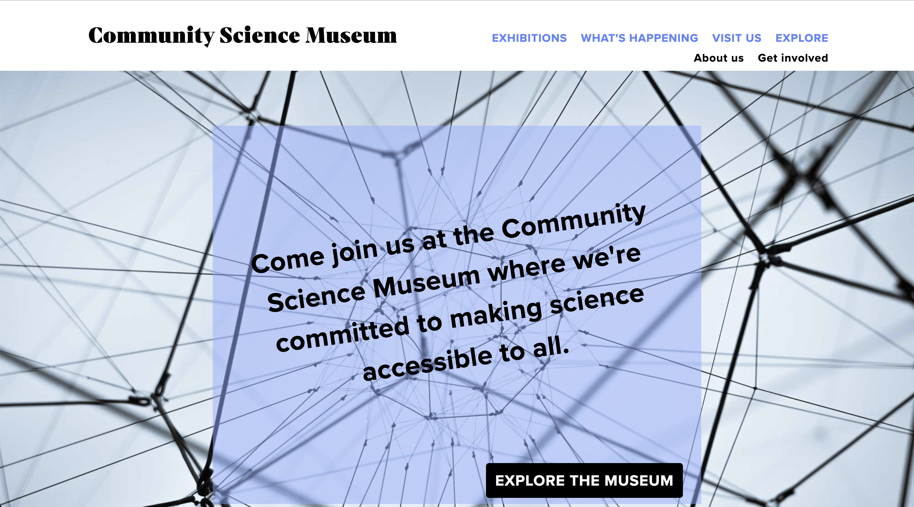

## Community Science Museum - Semester Project 1

## Description

The brief for Semester Project 1 was to make an informative and engaging web site for a fictional musuem, called Community Science Museum.

- Target audiene: primary and middle school children (7-15) and families with young children.
- The site should appeal to youngsters without pandering; it should take for granted that the audience is inquisitive and intelligent.
- The website should be responsive and easy to use on a variety of devices.

[Visit site](https://cms-oslo.netlify.app)

## Built with

- HTML
- CSS

## Contact

[My portfolio](https://www.mathildeelinor.no)
